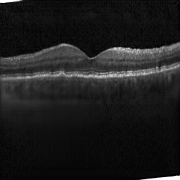
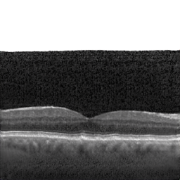
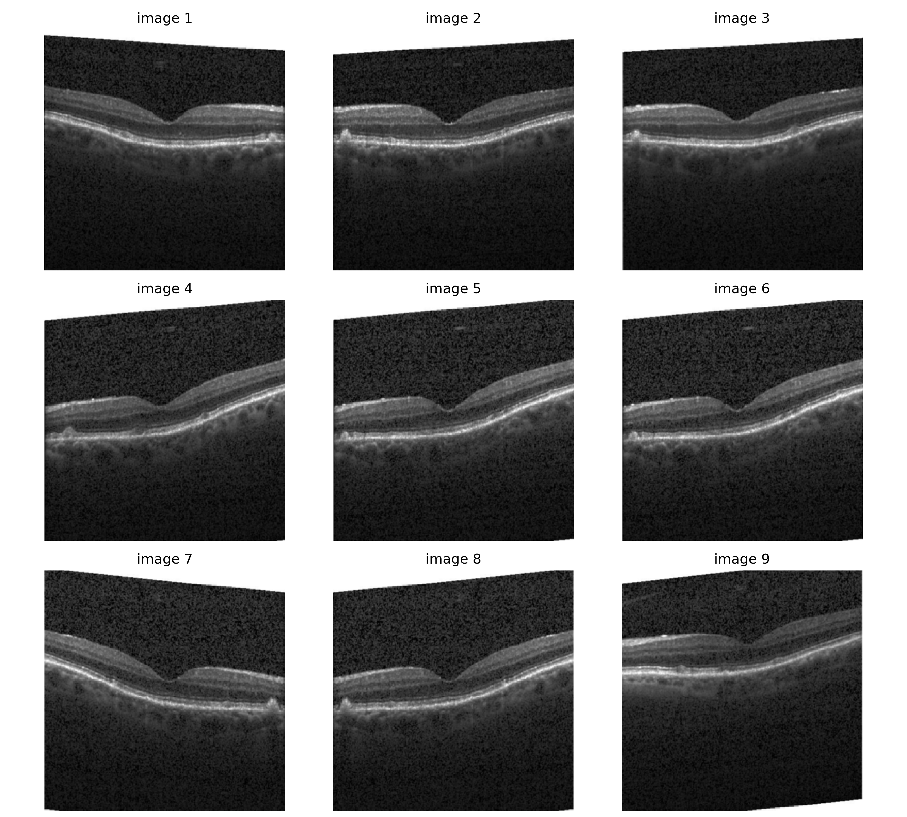

# OCT_GANs
Improving the diagnosis of retinal diseases through machine learning OCT image generation.

## Partners
- [CRIStAL (Lille Computer Science, Signal and Automation Research Center)](https://www.cristal.univ-lille.fr/spip.php?page=rubrique&id_rubrique=1) 
- [Temeoo](https://www.temeoo.fr/)
- [The Pitié Salpêtrière University Hospital](https://pitiesalpetriere.aphp.fr/hopital-universitaire-pitie-salpetriere/)

## Objective
***The main objective of this project is to develop and evaluate an AI method to 
generate synthetic retinal OCT images from existing data. This will overcome limitations 
related to real OCT images acquisition and contribute to advances in ophthalmology research.***

The specific objectives are as follows:
- Design and implement a deep learning model capable of generating
high quality synthetic retinal OCT images.
- Collect and preprocess an existing retinal OCT dataset, ensuring
that it is representative of different retinal conditions.
- Train the AI model to generate synthetic OCT images using the set of
preprocessed data.
- Evaluate the performance of the model by comparing the generated synthetic images
to real OCT images from patients.

This project will assist in overcoming the lack of real retinal OCT images by providing a
powerful tool for generating high-quality synthetic images, therefore contributing to achieving 
progress in the field of retinopathy and medical imaging.

## Methods

### 1. ProGAN DRUSEN OCT generation
The goal is to produce DRUSEN-affected OCT images.
I recommend you check out the notebooks in the directory which are also available on kaggle and colab. They're quite detailed.
The images looks pretty good. I bet training to 512 (original size) would looks good as well.
#### Results :
Examples of generated images at a definition of 256 by 256 pixels :

Examples of real images :

### 2. : cycleGAN DFE to OCT
Quick exploration of the paper model architecture. Implementation at 256x256 pixels. Mixed results after training for a few epochs. 
Maybe need deeper training ? I'll explore pix2pix in the meantime to try to reproduce results.

Back to cycleGAN : I trained for 10 epochs on 2000 images and got way better results (learning rate = 1e-5 different than in the paper = 2e-4)
DFE to OCT looks better than the opposite.

I saved the weights but I may not reuse them. Let's allow the model to run on two GPUs and train on kaggle with the paper learning rate.
Note : global loss was still decreasing (not identity mapping loss but we set lambda_identity to 0)

### ***WIP*** 3. : pix2pix DFE to OCT
The goal is to map dilated fundus examination (DFE) images to OCT images in order to enhance the diagnosis from a DFE image.
We use a training dataset where DFEs are mapped to corresponding OCTs.
We'll try to get coherent images that are at least 256px.

Relevant paper : Wang, Lehan, Weihang Dai, Mei Jin, Chubin Ou, and Xiaomeng Li. [“Fundus-Enhanced Disease-Aware Distillation Model for Retinal Disease Classification from OCT Images.”](https://doi.org/10.48550/arXiv.2308.00291) arXiv, August 1, 2023. 
This paper implements the reverse of what we propose to do. It uses DFE images to complement diagnoses from OCT scans. Moreover, DFE and OCT are **not** paired during training which lessens the data requirements to train the model. We'll study the feasibility of reversing the model to complement DFE images with OCT scans. The reasoning of the paper is that OCT scans and DFE images are complementary. We'll have to test that hypothesis as well. 

Another possibility is using pix2pix with horses = DFE and zebra = OCT (just as in the Centrale paper) and see if results are meaningful.
Maybe StyleGAN could help explore the intra-pathology distribution.
